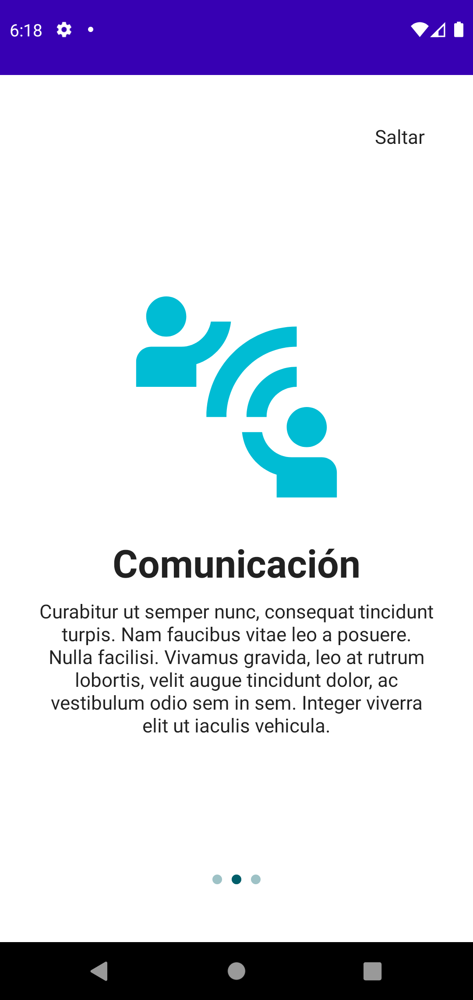

# Pantalla Onboarding para Android con Jetpack Compose

Ejemplo de creación de una pantalla de ayuda para que los usuarios entiendan cómo utilizar una aplicación.

Tecnologías:
- Android
- Jetpack Compose
- Accompanist Pager
- Accompanist Navigation Animation

